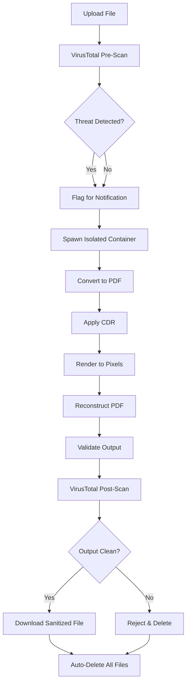

# CleanSheet

<div align="center">


[](https://buymeacoffee.com/onlycyber)
[](https://onlycyber.net/)

**Advanced Neural Document Sanitization System**

A multi-layered security platform for sanitizing documents using Content Disarm & Reconstruction (CDR), VirusTotal integration, and isolated container processing.

*Inspired by [Dangerzone](https://dangerzone.rocks/) from Freedom of the Press Foundation*

[Features](#features) • [Installation](#installation) • [Usage](#usage) • [Security](#security-features) • [Architecture](#architecture)

</div>

---

## 🛡️ Overview

CleanSheet is an enterprise-grade document sanitization service that removes malware, macros, scripts, and embedded threats from uploaded documents. Inspired by the excellent [Dangerzone](https://dangerzone.rocks/) application, CleanSheet provides a web-based, multi-user approach to document sanitization with enhanced features like VirusTotal integration and real-time processing visualization.

It employs a defense-in-depth approach with multiple security layers:

- **VirusTotal Integration** - Multi-engine malware scanning
- **Content Disarm & Reconstruction (CDR)** - Neutralizes active content
- **Isolated Processing** - Air-gapped Docker containers with no network access
- **Pixel Rendering** - Ultimate sanitization by converting documents to pixels and back
- **Metadata Stripping** - Complete removal of all document metadata


## ✨ Features

### Security Features

- 🔍 **Pre & Post Scanning** - VirusTotal integration for comprehensive threat detection
- 🔒 **Air-Gapped Processing** - Worker containers run with no network access
- 🧹 **Macro Removal** - Automatically strips VBA macros from Office documents
- 🚫 **JavaScript Elimination** - Removes all JavaScript from PDFs
- 📋 **Embedded Object Removal** - Strips embedded files and attachments
- 🔐 **Metadata Sanitization** - Removes EXIF data and document metadata
- 🎨 **Pixel-Level Reconstruction** - Converts documents to pixel matrices and rebuilds them

### Technical Features

- 🐳 **Docker-Based Isolation** - Spawns ephemeral containers for each job
- 🚀 **Automatic Cleanup** - Removes all traces after processing
- 📊 **Real-Time Progress** - Visual processing steps and status updates
- 🎯 **Multi-Format Support** - Handles PDFs, Office documents, and images
- 💾 **No Storage** - Files deleted immediately after download
- 🎨 **Modern UI** - Cyberpunk-themed interface with interactive animations

## 📋 Prerequisites

- **Docker** (20.10+) and **Docker Compose** (2.0+)
- **VirusTotal API Key** (free tier available at [virustotal.com](https://www.virustotal.com))
- **4GB RAM** minimum
- **Linux/macOS** (Windows with WSL2)

## 🚀 Installation

### 1. Clone the Repository

```bash
git clone https://github.com/CyberBigfoot/cleansheet.git
cd cleansheet
```

### 2. Configure VirusTotal API Key

Edit `docker-compose.yml` and replace `YOUR_KEY_HERE` with your VirusTotal API key:

```yaml
environment:
  - VIRUSTOTAL_API_KEY=your_actual_api_key_here
```

**Note:** CleanSheet will work without a VirusTotal API key, but scanning features will be disabled.

### 3. Build and Start

```bash
docker-compose up --build
```

The application will be available at `http://localhost:10400`

## 📖 Usage

### Web Interface

1. Navigate to `http://localhost:10400`
2. Click the upload area or drag & drop a file
3. Click "🛡️ SANITIZE DOCUMENT"
4. Watch the real-time processing steps
5. Download the sanitized PDF automatically

### Supported File Types

| Category | Extensions |
|----------|------------|
| **PDF** | `.pdf` |
| **Office** | `.doc`, `.docx`, `.xls`, `.xlsx`, `.ppt`, `.pptx`, `.rtf`, `.odt` |
| **Images** | `.jpg`, `.jpeg`, `.png` |

**File Size Limit:** 100MB

## 🏗️ Architecture

```
┌─────────────────────────────────────────────────────────┐
│                    User Upload                          │
└───────────────────────┬─────────────────────────────────┘
                        │
                        ▼
┌─────────────────────────────────────────────────────────┐
│              Flask Web Application                      │
│  • File validation & size checking                      │
│  • VirusTotal pre-scan (informational)                  │
│  • Job orchestration                                    │
└───────────────────────┬─────────────────────────────────┘
                        │
                        ▼
┌─────────────────────────────────────────────────────────┐
│          Isolated Docker Worker Container               │
│  ╔═══════════════════════════════════════════════╗     │
│  ║  Security Configuration:                      ║     │
│  ║  • network_mode: none (no internet)          ║     │
│  ║  • cap_drop: ALL (no capabilities)           ║     │
│  ║  • read_only: filesystem                      ║     │
│  ║  • no-new-privileges: true                    ║     │
│  ╚═══════════════════════════════════════════════╝     │
│                                                          │
│  Step 1: Convert to PDF (strips macros)                │
│  Step 2: Apply CDR (remove scripts/objects)             │
│  Step 3: Render to pixels (200 DPI)                     │
│  Step 4: Reconstruct PDF from pixels                    │
│  Step 5: Validate output                                │
└───────────────────────┬─────────────────────────────────┘
                        │
                        ▼
┌─────────────────────────────────────────────────────────┐
│              VirusTotal Post-Scan                       │
│  • Scan sanitized output                                │
│  • Verify no threats remain                             │
└───────────────────────┬─────────────────────────────────┘
                        │
                        ▼
┌─────────────────────────────────────────────────────────┐
│              Sanitized PDF Download                     │
│  • Automatic download                                   │
│  • Immediate file deletion                              │
│  • Complete trace removal                               │
└─────────────────────────────────────────────────────────┘
```

## 🔒 Security Features

### Container Isolation

Each document is processed in a completely isolated container:

```yaml
network_mode: none              # No network access
security_opt:
  - no-new-privileges:true      # Prevent privilege escalation
cap_drop: [ALL]                 # Drop all Linux capabilities
mem_limit: 2g                   # Memory limit
cpu_quota: 100000               # CPU limit
tmpfs: {/tmp: 'size=1g'}       # In-memory temp filesystem
```

### Threat Removal Techniques

1. **Macro Stripping** - Automatic removal during Office → PDF conversion
2. **JavaScript Elimination** - Scans and removes all JS from PDFs
3. **Embedded File Removal** - Strips all embedded/attached files
4. **Form & Action Removal** - Disables interactive PDF elements
5. **Metadata Sanitization** - Removes EXIF, author, creation date, etc.
6. **Pixel Reconstruction** - Ultimate sanitization via pixel rendering

### Process Flow



## ⚙️ Configuration

### Environment Variables

| Variable | Description | Default | Required |
|----------|-------------|---------|----------|
| `VIRUSTOTAL_API_KEY` | VirusTotal API key for scanning | None | No* |
| `HOST_PWD` | Host working directory | `/app` | Yes |
| `MAX_FILE_SIZE` | Maximum upload size | 100MB | No |

*CleanSheet works without VirusTotal but scanning will be disabled

### Docker Compose Configuration

Edit `docker-compose.yml` to customize:

- Port mapping (default: `10400:10400`)
- Volume mounts
- Memory/CPU limits
- API keys

## 🐛 Troubleshooting

### Worker Container Fails to Build

```bash
# Rebuild worker image manually
docker build -f Dockerfile.worker -t cleansheet-worker:latest .
```

### Permission Errors with Docker Socket

```bash
# Add your user to docker group
sudo usermod -aG docker $USER
# Logout and login for changes to take effect
```

### VirusTotal Rate Limiting

Free tier: 4 requests/minute. If you hit limits:
- Wait 60 seconds between uploads
- Upgrade to premium API key
- Disable VirusTotal (app will still sanitize)

### Output File Empty

Check worker logs:
```bash
docker-compose logs cleansheet
```

Common causes:
- Corrupted input file
- Unsupported file format
- LibreOffice conversion failure

## 🔧 Development

### Project Structure

```
cleansheet/
├── app.py                    # Main Flask application
├── worker.py                 # Isolated sanitization worker
├── Dockerfile                # Main service container
├── Dockerfile.worker         # Worker container
├── docker-compose.yml        # Orchestration config
├── requirements.txt          # Python dependencies
├── requirements-worker.txt   # Worker dependencies
├── uploads/                  # Temporary upload storage
└── output/                   # Temporary output storage
```

### Running in Development Mode

```bash
# Enable debug mode
FLASK_DEBUG=1 docker-compose up
```

### Adding New File Format Support

Edit `worker.py` and add conversion logic in the `convert_to_pdf()` function.

## 📊 Performance

- **Processing Time**: 5-30 seconds depending on document size
- **Memory Usage**: ~500MB per worker container
- **Concurrent Jobs**: Limited by system resources
- **Throughput**: ~100 documents/hour on 4-core system

## ⚠️ Limitations

- Maximum file size: 100MB
- No cloud storage integration
- Single-server deployment only
- No user authentication
- No job queue for high volume

## 🆚 CleanSheet vs Dangerzone

While inspired by [Dangerzone](https://dangerzone.rocks/), CleanSheet offers some different features:

| Feature | CleanSheet | Dangerzone |
|---------|-----------|------------|
| **Deployment** | Web-based service | Desktop application |
| **Multi-user** | ✅ Yes | ❌ No |
| **VirusTotal Integration** | ✅ Yes | ❌ No |
| **Real-time Progress UI** | ✅ Yes | ✅ Yes |
| **Container Isolation** | ✅ Yes | ✅ Yes |
| **Platform** | Linux/Docker | Windows/Mac/Linux |
| **OCR Support** | ❌ No | ✅ Yes |
| **Best For** | Team/server deployments | Individual desktop use |

**Use Dangerzone if:** You need a desktop application with OCR capabilities  
**Use CleanSheet if:** You need a web service for teams or automated workflows


## 📄 License

This project is licensed under the MIT License - see the [LICENSE](LICENSE) file for details.

## ⚠️ Disclaimer

**Important:** CleanSheet is a security tool designed to remove threats from documents. However:

- No security system is 100% effective
- Always practice defense in depth
- Sanitized documents should still be treated with caution
- This tool is provided as-is without warranty
- Use in production environments at your own risk
- Not responsible for any damages or data loss

## 🙏 Acknowledgments

- **[Dangerzone](https://dangerzone.rocks/)** by [Freedom of the Press Foundation](https://freedom.press/) - The original inspiration for this project. Dangerzone pioneered the container-based document sanitization approach.
- [VirusTotal](https://www.virustotal.com) for their excellent API
- [Docker](https://www.docker.com) for containerization technology
- [pdf2image](https://github.com/Belval/pdf2image) for PDF rendering
- [LibreOffice](https://www.libreoffice.org) for document conversion
- [ReportLab](https://www.reportlab.com) for PDF generation

## 📚 Related Projects

- **[Dangerzone](https://github.com/freedomofpress/dangerzone)** - Desktop document sanitization application
- **[QubesOS](https://www.qubes-os.org/)** - Security-focused operating system with similar isolation principles
- **[Cuckoo Sandbox](https://cuckoosandbox.org/)** - Automated malware analysis system


---

<div align="center">

**Made with 🛡️ by CyberBigfoot**

*Standing on the shoulders of giants like Dangerzone*

</div>
